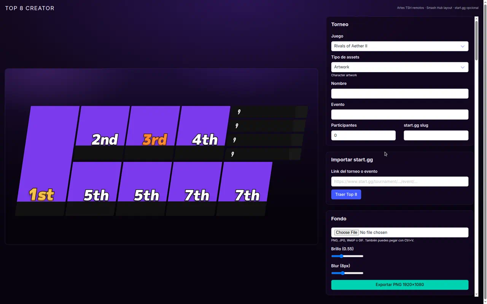

# Top 8 Creator

Generador local de gráficos **Top 8** en 1920×1080 para torneos de fighting games.

El layout sigue el estilo Smash Hub. Las artes de personaje e iconos se cargan en remoto desde [Tournament Stream Helper](https://github.com/joaorb64/StreamHelper) / [StreamHelperAssets](https://github.com/joaorb64/StreamHelperAssets): no hace falta una instalación local de TSH.



## Características

- Lienzo fijo **1920×1080** listo para stream o redes
- Catálogo de juegos y packs de arte de StreamHelperAssets
- Top 8 (1st–7th) más una fila de Top 9
- Edición de tag, prefix, personaje, skin, secundarios y color de tarjeta
- Fondo personalizado (archivo o `Ctrl+V`), con brillo y blur
- Importación opcional de standings y personajes desde [start.gg](https://www.start.gg)
- Exportar PNG 1920×1080

## Requisitos

- [Node.js](https://nodejs.org/) 20 o superior
- npm
- Conexión a internet (artes TSH y, si aplica, start.gg)

## Instalación

```bash
git clone https://github.com/GrimmGW/top8er-revamp--by-Grimm-.git
cd top8er-revamp--by-Grimm-
npm install
cp .env.example .env
npm run dev
```

Abre [http://localhost:5173](http://localhost:5173).

## start.gg (opcional)

El editor funciona sin token. El token solo hace falta para **Traer Top 8**.

1. Crea un token en [start.gg Developer](https://developer.start.gg/).
2. Añádelo a `.env`:

```env
STARTGG_TOKEN=tu_token
```

3. Reinicia `npm run dev`.
4. Pega el link del torneo o del evento y pulsa **Traer Top 8**.

La importación rellena nombre del torneo, evento, número de participantes, tags y personajes usados en los sets. Revisa skins y secundarios antes de exportar.

## Uso

1. Elige **juego** y **tipo de assets**.
2. Completa nombre del torneo, evento y participantes, o impórtalos desde start.gg.
3. Ajusta cada slot: prefix, jugador, personaje, skin, secundarios y color.
4. Sube o pega un fondo y regula brillo y blur.
5. Pulsa **Exportar PNG 1920×1080**.

## Tipografías

| Uso | Archivo |
| --- | --- |
| Nombres y títulos | `public/fonts/DINPro-CondBlackIta.otf` |
| Prefix y textos ligeros | `public/fonts/DINPro-CondLightIta.otf` |
| Placement 1st–7th | `public/fonts/DFGGothic-SU.otf` |

Si no está DFG Gothic SU, el placement usa [M PLUS 1p](https://fonts.google.com/specimen/M+PLUS+1p) 900. Suelta `DFGGothic-SU.otf` o `.ttf` en `public/fonts/` para usarla.

## Scripts

| Comando | Descripción |
| --- | --- |
| `npm run dev` | Servidor de desarrollo en el puerto 5173 |
| `npm run build` | Build de producción |
| `npm run preview` | Preview del build en el puerto 4173 |

## Stack

- [React 19](https://react.dev) + [Vite 7](https://vite.dev)
- [Bulma](https://bulma.io) para el panel del editor
- [modern-screenshot](https://github.com/qq15725/modern-screenshot) para el PNG
- Plugin de Vite que proxifica [StreamHelperAssets](https://github.com/joaorb64/StreamHelperAssets)

## Créditos

- Artes e iconos: [joaorb64/StreamHelperAssets](https://github.com/joaorb64/StreamHelperAssets)
- Layout inspirado en gráficos tipo Smash Hub
- Importación: [start.gg GraphQL API](https://developer.start.gg/)
